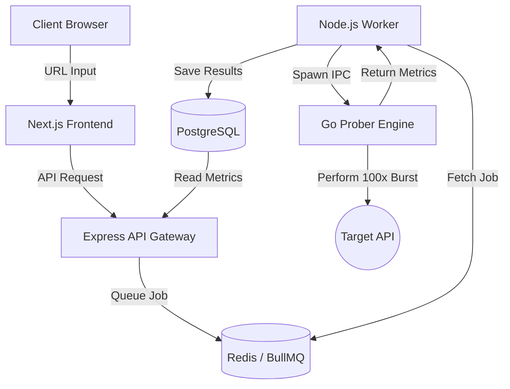

#  Lumen


> A high-performance, polyglot network telemetry and API monitoring platform.

Lumen is an enterprise-grade API monitoring platform designed to perform deep, high-frequency telemetry audits. Built with a modern, polyglot monorepo architecture, it leverages **TypeScript/Node.js** for seamless orchestration and web delivery, paired with a specialized **Go** engine for bare-metal network performance probing.

## 🚀 Key Features

- **High-Performance Go Engine**: Specialized CLI utility utilizing `net/http/httptrace` for conducting 100-request burst telemetry, yielding DNS, TCP, TLS, TTFB, and P95/P99 latency metrics.
- **Polyglot Monorepo**: Managed seamlessly with **Turborepo** and **pnpm workspaces**.
- **Asynchronous Job Processing**: Scalable job execution using **BullMQ** and **Upstash Redis**, ensuring non-blocking API orchestration.
- **Robust Data Layer**: Type-safe data access powered by **Drizzle ORM** against a **PostgreSQL** database.
- **High-Fidelity Dashboard**: A modern frontend built with **Next.js**, **Tailwind CSS**, and **Framer Motion** for visualizing real-time metrics.

## 🏗 Architecture



### Components
- **Frontend (Next.js)**: Dashboard hosted on Vercel, providing an interactive UI and data visualization.
- **API (Express)**: Handles JWT + HttpOnly cookie authentication and queues audit requests.
- **Worker (Node.js)**: A background consumer that delegates intense network probing to the Go engine.
- **Engine (Go)**: A highly-optimized, compiled binary focused entirely on low-level network performance and memory efficiency.
- **Database (@repo/database)**: Shared package using Drizzle ORM to ensure strict type safety across Node.js boundaries.

## 🛠 Tech Stack

- **Monorepo**: Turborepo, pnpm workspaces
- **Frontend**: Next.js, Tailwind CSS, Framer Motion
- **Backend**: Express (Node.js)
- **Prober Engine**: Go
- **Database**: PostgreSQL (Neon), Drizzle ORM
- **Queue/Cache**: BullMQ, Redis
- **Containerization**: Docker, Docker Compose

## 💻 Local Development Setup

### Prerequisites
- Node.js (v20+)
- pnpm (`npm install -g pnpm`)
- Go (v1.22+)
- Docker & Docker Compose

### Getting Started

1. **Clone the repository:**
   ```bash
   git clone https://github.com/your-username/lumen.git
   cd lumen
   ```

2. **Install dependencies:**
   ```bash
   pnpm install
   ```

3. **Configure Environment:**
   ```bash
   cp .env.example .env
   # Update the .env file with your database and redis credentials.
   ```
   > 💡 Note: If you want to run the database and Redis locally using Docker, see the [Docker Setup Guide](docker.md).

4. **Run the Development Server:**
   ```bash
   pnpm dev
   ```
   This will spin up all workspace applications in parallel using Turborepo.

## 🐳 Docker Deployment

The project is fully containerized and ready for resource-constrained environments (e.g., 1GB RAM GCP e2-micro instances). 

For detailed instructions on running the entire stack via Docker Compose, refer to the [Docker Setup Guide](./docker.md).

## 📄 License

This project is licensed under the ISC License.
